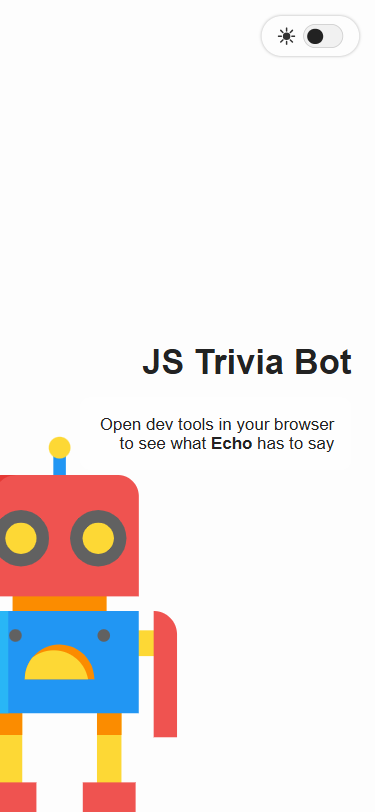
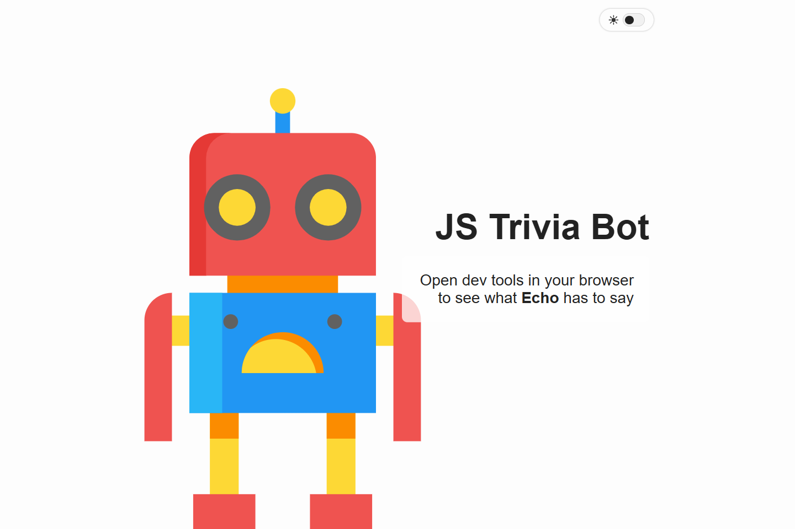
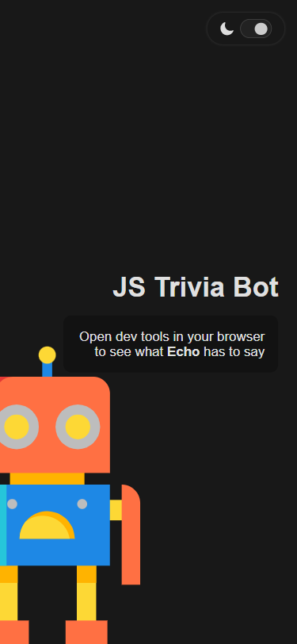
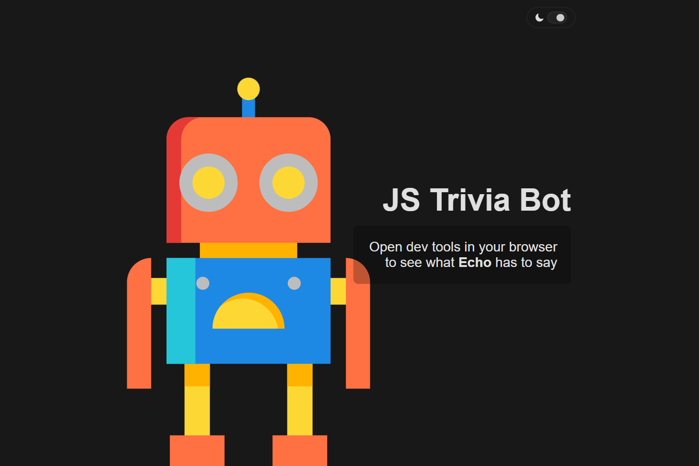

# 💻 JS Trivia Bot

## ℹ️ A Simple JS Trivia Bot Landing Page

| _Mobile Preview (375x812)_                                   | _Desktop Preview (1440x960)_                                    |
| ------------------------------------------------------------ | --------------------------------------------------------------- |
|       |       |
|  |  |

A fun, single-page landing project featuring a themed “JS Trivia Bot” built with semantic HTML, responsive CSS, and interactive JavaScript. It demonstrates basic DOM manipulation with `console.log()` and toggles between light and dark modes using `localStorage` and the `prefers-color-scheme` media query.

Created as part of the lab challenges from [**freeCodeCamp.org**](https://www.freecodecamp.org/learn/full-stack-developer/) JavaScript course.

---

## 🔍 Overview

This project introduces a fictional trivia bot named **Echo**, who shares some JavaScript-related fun facts in the console. The page includes a clean, animated interface, a theme toggle with saved user preferences, and a mobile-first responsive design.

The entire layout is semantically structured, accessibility-conscious, and includes visual polish via transitions, keyframe animations, and SVG background art.

---

## ✨ Features

- Animated theme toggle (light/dark mode)
- Custom shake animation on title click
- Console-based JavaScript trivia facts from the bot
- Fully responsive, mobile-first layout
- Semantic, accessible HTML5 structure
- Smooth transitions with reduced-motion support
- Color theming using CSS variables for easy customization

---

## 🧠 What I Learned

- How to use semantic HTML and structure clean, readable markup
- Gained more experience in Writing reusable utility CSS with custom properties
- Applied more CSS `@keyframes` and `transition` for interactive UI elements
- Implementation of responsive typography with `clamp()`
- Respecting `prefers-reduced-motion` for accessibility
- Writing concise, beginner-friendly JavaScript DOM scripts with `console.log()`

---

## 🛠️ Tech Used

- HTML5
- CSS3
- JavaScript
- Git
- GitHub
- Netlify

---

## 🚀 How to Run

1. Clone the repository
2. Open `index.html` in your browser

---

## 🌐 Live Demo

Or you can check out the 👉 [live website here](LINK)

---

## 📊 Performance Report

A **Google Lighthouse** audit was conducted on the final version of this project. You can view the full report [here](./assets/downloads/lighthouse-performance-report.pdf).

---

## 🧑‍💻 Author

Created by **Elmar Chavez**

🗓️ Month/Year: **July 2025**

📚 Journey: **4th** month of learning _frontend web development_.

<!--

FREECODECAMP TAGS:
html css javascript vscode git github netlify 4th-month freecodecamp project lighthouse theme-toggle

-->
